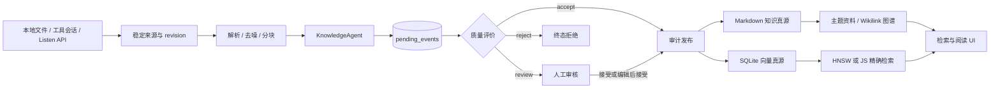

# Auto-Memories-Doll

本地优先的知识整理 Agent。它观察 Markdown、文本和开发工具会话目录，把来源版本转成可审核、可检索、可追溯的 Markdown 知识与主题学习资料。

这不是聊天产品。项目不提供聊天会话、用户画像、人格 Prompt、聊天型 MCP/Skills 或浏览器历史采集。

## 核心链路



关键保证：未变化来源不会重复入队；候选不能绕过审计直接发布；模型不确定时 fail-closed 转人工；每条主题资料都引用知识 ID 和来源版本。

## 本地运行

前置要求：Node.js 22+、npm 10+。模型凭证可选；无凭证时仍可采集、浏览和进行关键词检索，但新候选会等待人工审核。

```bash
npm ci
cp .env.example .env.local
npm run dev
```

打开 `http://127.0.0.1:3000`。服务只绑定回环地址，非本机 Host 请求会被拒绝。

最小配置：

```env
MEMORY_ROOT=./memory-root
MODEL_BASE_URL=https://api.openai.com/v1
MODEL_API_KEY=
VECTOR_BACKEND=hnsw
```

模型与 Embedding 可以在 `/settings/ai` 分别配置；来源目录在 `/settings/tools` 管理；笔记目录可在 `/settings/storage` 迁移。

## 使用流程

1. 在“来源设置”新增 Markdown、Text、Codex、Claude Code、Cursor 或 Trae 目录。
2. 等待 watcher，或点击“扫描所有来源”。
3. 在状态页查看 `sourceId / revision / eventId / stage / duration`。
4. 在审核工作台处理 `review` 候选和字段冲突。
5. 在检索库使用关键词、向量、标签、查询改写、图谱邻居和 MMR 重排。
6. 打开主题资料，沿知识链接与来源版本追溯原始依据。

外部工具也可以向 `POST /api/listen` 发送类型化会话：

```bash
curl -X POST http://127.0.0.1:3000/api/listen \
  -H "Content-Type: application/json" \
  -d '{
    "source": "local-tool",
    "messages": [
      {"role": "user", "content": "为什么来源版本必须稳定？"},
      {"role": "assistant", "content": "稳定 revision 让重复扫描成为无操作。"}
    ],
    "topic": "learning"
  }'
```

## 存储与隐私

```text
memory-root/
├─ memory.db                  # 队列、来源版本、向量真源和配置
├─ memory.db.ann-*.usearch    # 可重建的 HNSW sidecar
├─ notes/{topic}/{id}.md      # 规范知识
├─ guides/{topic}.md          # 带引用的主题学习资料
└─ archive/                   # 审计、失败与版本记录
```

- Markdown 是人类可读的知识真源；SQLite 保存事务状态与向量记录。
- 本地文件只有在配置远程模型后才会发送必要片段，发送前执行密钥模式脱敏。
- API Key 只从环境变量或本地 SQLite 配置读取，不应提交到 Git。
- 旧聊天、画像和 MCP/Skills 数据不会被运行时读取，也不会被迁移过程主动删除。

## 故障行为

| 故障 | 行为 |
| --- | --- |
| LLM 不可用或输出非法 | 依赖模型的候选进入 `review`，不发布 |
| Embedding 不可用 | 新候选因无法语义去重转人工；既有知识搜索退回关键词 |
| 来源未变化 | 返回 unchanged/no-op，不创建副本 |
| 进程在 processing 中断 | 原事件恢复，attempt 递增后重试 |
| Markdown 写入或 schema 校验失败 | 保留失败上下文，不静默覆盖 |
| HNSW 缺失、损坏或版本不一致 | 从 SQLite `vector_records` 自动重建；失败时用 JS 精确后端 |
| 主题资料引用非法 | 拒绝新版本并保留上一份合法资料 |

## 重建

- 重扫来源：在 `/settings/tools` 点击“扫描所有来源”，或 `POST /api/listen/scan`。
- 重建既有知识任务：在 `/memory` 点击“全量扫描重建”，或 `POST /api/memory/rebuild`。
- 重建主题资料：打开 `/memory/topic/{topic}` 点击“刷新资料”；API 为 `POST /api/topics/{topic}`，请求体 `{"modelAssist":false,"force":true}`。
- 重建 HNSW：停止服务，删除对应的 `memory.db.ann-{dimensions}.usearch` sidecar 后重启。SQLite 向量真源和 Markdown 不会被修改。

不要删除 `memory.db` 来“重建索引”，它包含队列、来源版本与向量真源。

## 工程验证

```bash
npm run format:check
npm run typecheck
npm run lint
npm run audit:dead-code
npm run test:coverage
npm run eval
npm run build
npm run test:e2e
```

检索评测使用 26 条记忆和 38 条查询，覆盖精确、关键词、口语、含噪、同义词、主题过滤和近似重复场景。阈值与最新报告由 `npm run eval` 生成到 `evals/reports/`。

## 作品集材料

- [LKA-001 规范](docs/specs/001-local-knowledge-agent/spec.md)
- [Phase 8 验证与指标报告](docs/specs/001-local-knowledge-agent/phase-8-delivery.md)
- [五分钟演示脚本](demo/phase8-demo.md)
- [当前架构图](结构图/knowledge-agent-phase8.md)
- [改造前基线](docs/specs/001-local-knowledge-agent/phase-0-baseline.md)

## 技术栈

TypeScript、Next.js 14、React 18、Vercel AI SDK、Zod、better-sqlite3、Chokidar、USearch HNSW、Tailwind CSS、Vitest、Playwright。

## English

Auto-Memories-Doll is a local-first knowledge organization agent. It turns versioned local files and development-tool sessions into reviewed, traceable Markdown knowledge and cited study guides. The product is deliberately not a chat application: uncertain model output is held for human review, unchanged sources are idempotent, and search remains available in keyword mode when embeddings fail.

See the Phase 8 report and deterministic Playwright flow for the portfolio-ready architecture, metrics, and acceptance evidence.

## License

MIT
