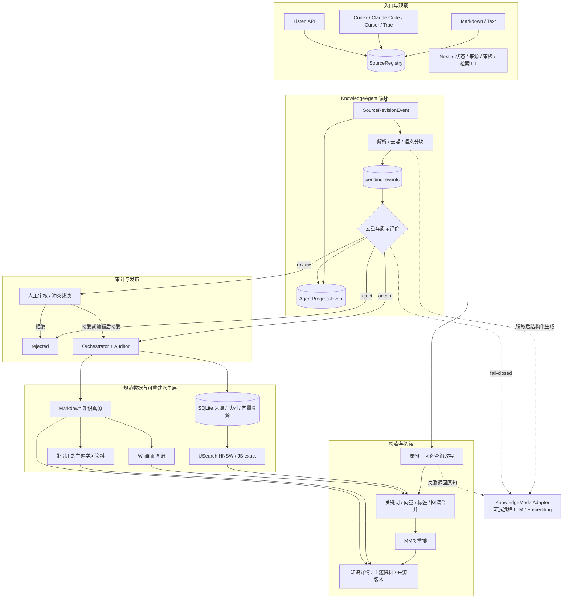

# LKA-001 Phase 8 架构图

## 边界

- 核心模块不依赖 React 或 Next.js Route Handler。
- `SourceRevisionEvent` 是采集入口契约，`AgentProgressEvent` 是可观察性契约。
- 未经接受的候选只存在于 SQLite 队列，不写入规范 Markdown。
- Markdown 和 SQLite `vector_records` 是重建依据；HNSW 与内存图谱可以丢弃后重建。
- 远程模型是可选增强，故障不会阻止本地阅读和关键词检索。
